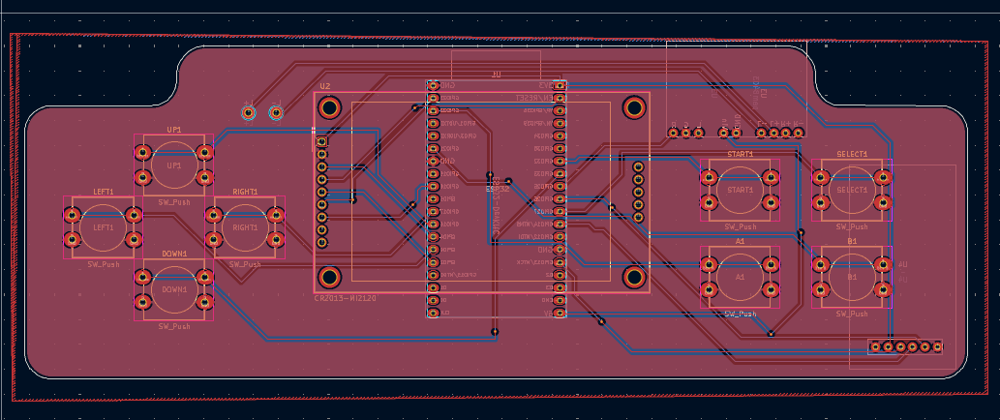
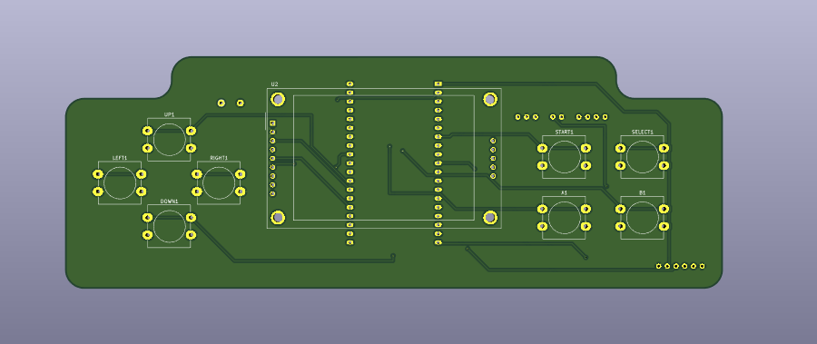
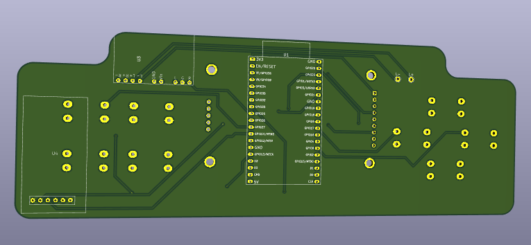

# ESP-NES - A Custom PCB for the ESP32 NES Emulator made by Shim06 

A custom-designed, all-in-one PCB that transforms a powerful ESP32 microcontroller into a fully functional Nintendo Entertainment System (NES) emulator.

# Here are Some image of pcb

and For the code and step by step guide go to the origins Repo <https://github.com/Shim06/Anemoia-ESP32>

And PCB file are in Releases part of repo
And if you find any issues pls open issues and let me know
